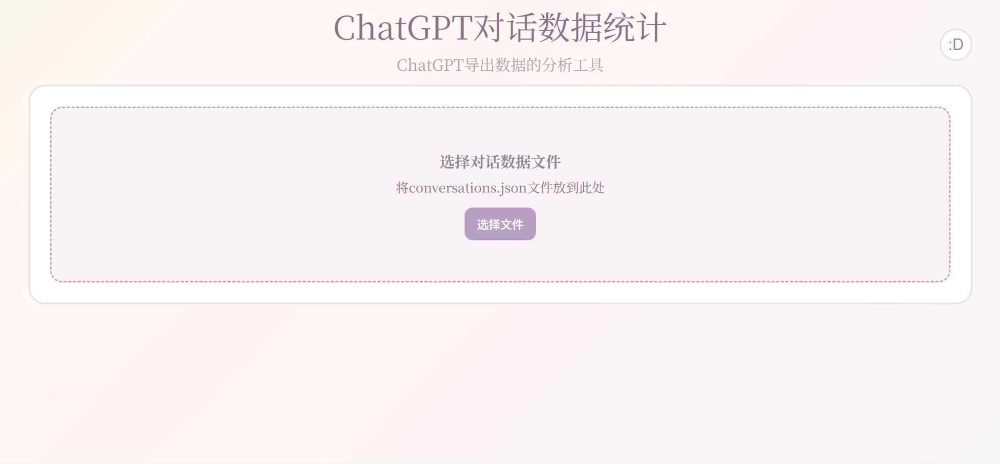
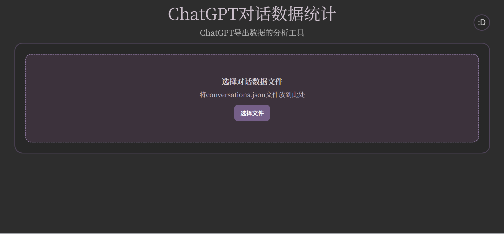
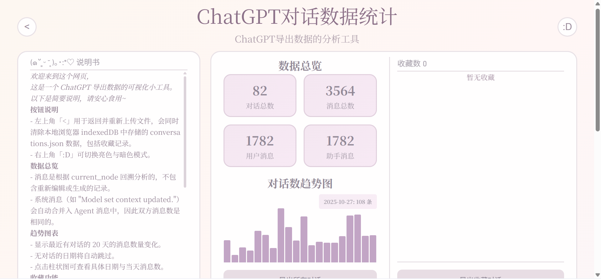
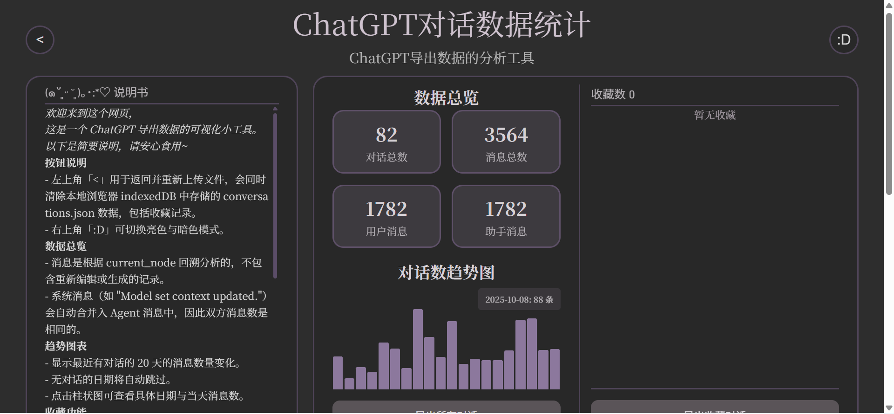
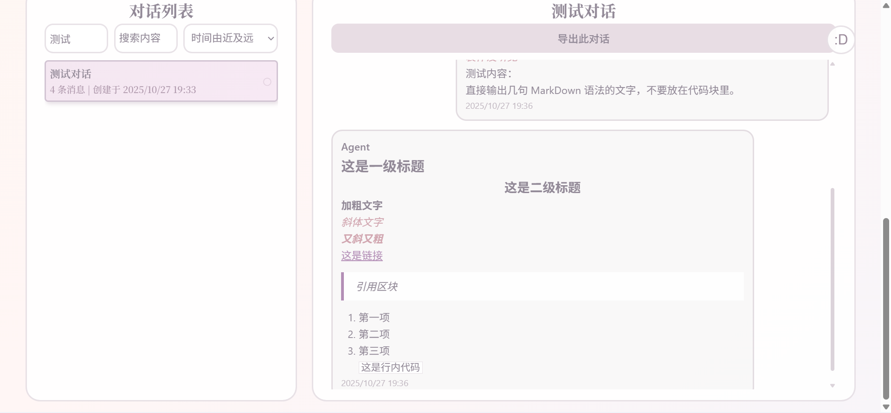
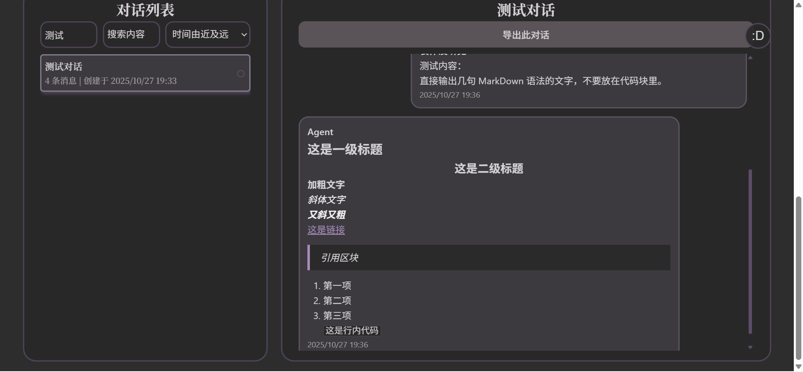

欢迎访问 (welcome to visit)：  
[https://kelushanqian.github.io/chatgpt_chat_visualizer/](https://kelushanqian.github.io/chatgpt_chat_visualizer/)  
or  
[https://chatgpt-chat-visualizer.vercel.app/](https://chatgpt-chat-visualizer.vercel.app/)  

欢迎来到这个网页，
这是一个 ChatGPT 导出数据的可视化小工具。
以下是简要说明，请安心食用~

按钮说明
- 左上角「<」用于返回并重新上传文件，会同时清除本地浏览器 indexedDB 中存储的 conversations.json 数据，包括收藏记录。
- 右上角「:D」可切换亮色与暗色模式。

数据总览
- 消息是根据 current_node 回溯分析的，不包含重新编辑或生成的记录。
- 系统消息（如 "Model set context updated."）会自动合并入 Agent 消息中，因此双方消息数是相同的。

趋势图表
- 显示最近 20 天的消息数量变化。
- 点击柱状图可查看具体日期与当天消息数。

收藏功能
- 点击对话列表右侧的圆形图标即可收藏。
- 重新上传文件会清空 indexedDB，收藏不会长期保存。可多选对话后一起导出 Markdown 文件，方便查看和保留。

搜索排序
- 搜索框支持根据标题或内容查找。
- 支持按时间、消息数或标题首字母排序。

其他说明
- 所有导出皆为 Markdown 格式，便于阅读与备份。生成卡片为 .png。
- 若未点击返回「<」便退出网页，下次会自动从本地浏览器的 indexedDB 加载你上次上传的 conversations.json 数据。
- 数据存储在本地浏览器的 indexedDB 中，点击返回按钮「<」会自动清除。
- 所有内容均离线保存在本地浏览器的 indexedDB，安全可靠。

---

Welcome to this webpage,  
This is a small visualization tool for ChatGPT export data.  
Below is a brief guide—enjoy at ease~

Button Guide
- The top-left "<" button is used to go back and re-upload files. It will also clear the conversations.json data stored in the browser's local indexedDB, including favorites.  
- The top-right ":D" button toggles between light and dark modes.

Data Overview
- Messages are analyzed by tracing back from the current_node, excluding any re-edited or regenerated records.  
- System messages (like "Model set context updated.") are automatically merged into Agent messages, so both sides have the same number of messages.

Trend Charts
- Displays message count changes for the last 20 days with conversations.  
- Dates without conversations are automatically skipped.  
- Click on a bar in the chart to see the specific date and the number of messages for that day.

Favorites
- Click the circular icon on the right side of a conversation in the list to mark it as a favorite.  
- Re-uploading a file will clear indexedDB, so favorites are not saved permanently. You can select multiple conversations and export them as a Markdown file for easier viewing and backup.

Search & Sorting
- The search box supports searching by title or content.  
- Sorting can be done by date, message count, or the first letter of the title.

Other Notes
- All exports are in Markdown format, convenient for reading and backup.  
- If you exit the webpage without clicking the "<" button, the next time it will automatically load the conversations.json data you last uploaded from the browser's local indexedDB.  
- Data is stored in the browser's local indexedDB; clicking the "<" button will automatically clear it.  
- All content is stored offline in the browser's local indexedDB, safe and reliable.

---

网页展示 (display)：

